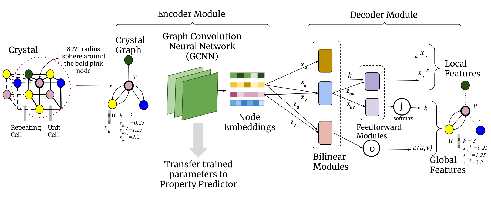
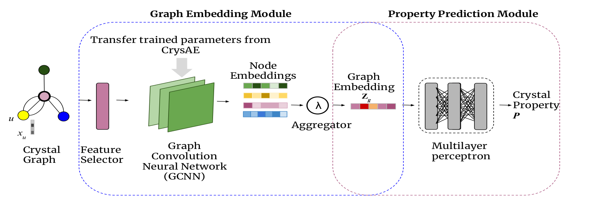

# CrysXPP: An Explainable Property Predictor for Crystalline Materials
<div align='left'><strong>Accepted in NPJ Computational Materials (Nature) Journal,2022. (Impact Factor: 13.2)</strong></div>
<div align='left'><strong>Kishalay Das, Bidisha Samanta, Pawan Goyal, Seung-Cheol Lee, Satadeep Bhattacharjee and Niloy Ganguly</strong></div>

## Overview of the work -
We present a deep-learning framework, CrysXPP, to allow rapid and accurate prediction of electronic, magnetic, and elastic properties of a wide range of materials. CrysXPP lowers the need for large property tagged datasets by intelligently designing an autoencoder, CrysAE. The important
structural and chemical properties captured by CrysAE from the large amount of available crystal graphs data helped in achieving low prediction errors. Moreover, we design a feature selector that provides interpretability to the results obtained. Most notably, when given a small amount
of experimental data, CrysXPP is consistently able to outperform conventional DFT. A detailed ablation study establishes the importance of different design steps. We release the large pre-trained model CrysAE. We believe by fine-tuning the model with a small amount of property-tagged data, researchers can achieve superior performance on various applications with a restricted data source.
It has two modules :

- Crystal Auto Encoder (CrysAE) : An auto-encoder based architecture which is trained with a large amount of unlabeled crystal data which leads to the deep encoding module capturing all the important structural and chemical information of the constituent atoms (nodes) of the crystal graph. 

    
    <div align='center'><strong>Figure 1. CrysAE Architecure.</strong></div>
    
- Crystal eXplainable Property Predictor (CrysXPP) : An Explainable Property Predictor, to which the knowledge acquired by the encoder is transferred and which is further trained with a small amount of property-tagged data.

    
    <div align='center'><strong>Figure 2. CrysXPP Architecure.</strong></div>

The following paper describes the details of the CrysXPP framework: [CrysXPP: An Explainable Property Predictor for Crystalline Materials](https://arxiv.org/pdf/2104.10869.pdf)

[<a href="https://github.com/kdmsit/crysxpp.git" target="_blank">Code</a>]
[<a target="_blank" href="https://kdmsit.github.io/assets/pdf/CRYSXPP.pdf">Slides</a>]
[<a href="https://www.youtube.com/watch?v=Kyrpj9cSkkM" target="_blank" >Video</a>]

## Cite as -

If youare using CrysXPP, please cite our work as follow :

```
@misc{das2021crysxppan,
      title={CrysXPP:An Explainable Property Predictor for Crystalline Material}, 
      author={Kishalay Das and Bidisha Samanta and Pawan Goyal and Seung-Cheol Lee and Satadeep Bhattacharjee and Niloy Ganguly},
      year={2021},
      eprint={2104.10869},
      archivePrefix={arXiv},
      primaryClass={cond-mat.mtrl-sci}
}
```


